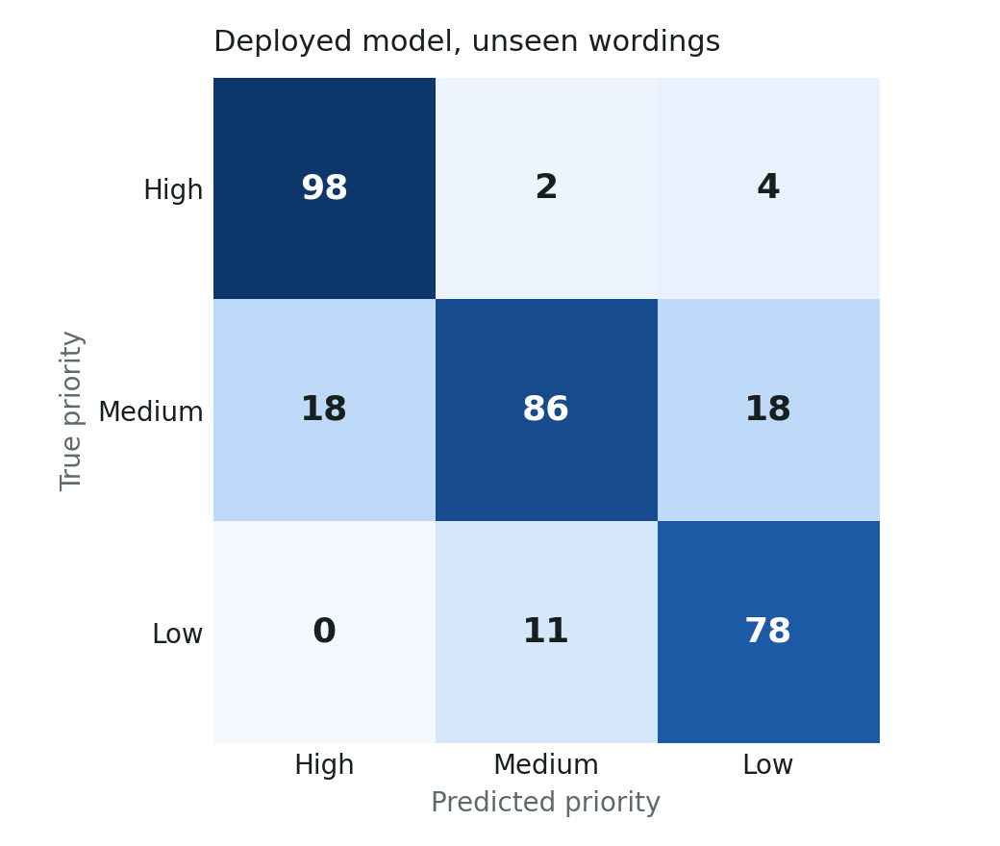
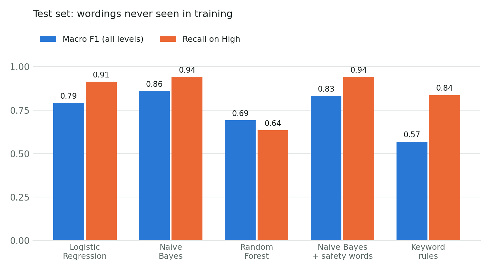

# Priority model results

Dataset: 1586 labelled requests from 61 problem scenarios and 168 sentence templates (High 519, Medium 611, Low 456).

## 1. Model selection (5-fold cross-validation, grouped by sentence template)

| Model | Macro F1 (mean ± sd) | Accuracy |
|---|---|---|
| Logistic Regression | 0.743 ± 0.046 | 0.744 |
| Complement Naive Bayes | 0.763 ± 0.070 | 0.764 |
| Random Forest | 0.660 ± 0.038 | 0.666 |

Chosen: **Complement Naive Bayes**. Deployed as **Complement Naive Bayes + safety words**: the model decides, but any safety word (fire, gas, sparks, burst, sewage, no water...) always gives High.

## 2. Main test: 315 requests worded differently from anything in training

| Method | Accuracy | Macro F1 | High recall | High precision |
|---|---|---|---|---|
| Logistic Regression | 0.790 | 0.791 | 0.913 | 0.872 |
| Complement Naive Bayes | 0.860 | 0.860 | 0.942 | 0.916 |
| Random Forest | 0.698 | 0.692 | 0.635 | 0.805 |
| Complement Naive Bayes + safety words | 0.832 | 0.832 | 0.942 | 0.845 |
| Keyword rules | 0.587 | 0.569 | 0.837 | 0.861 |
| Always Medium | 0.387 | 0.186 | 0.000 | 0.000 |

The deployed model reaches macro F1 0.83 (keyword rules alone: 0.57) and catches 94% of truly High requests.

Per class (deployed model):

| Priority | Precision | Recall | F1 | Requests |
|---|---|---|---|---|
| High | 0.845 | 0.942 | 0.891 | 104 |
| Medium | 0.869 | 0.705 | 0.778 | 122 |
| Low | 0.780 | 0.876 | 0.825 | 89 |

## 3. Stress test: 312 requests about problem types never seen in training

Held-out problem types: ap_fridge, ap_gas, ap_no_hot_water, el_switch_broken, ot_clothesline, ot_fire, ot_flood_compound, ot_noise, pl_burst, se_window_grill, st_broken_glass, st_paint.

| Method | Accuracy | Macro F1 | High recall | High precision |
|---|---|---|---|---|
| Logistic Regression | 0.253 | 0.203 | 0.070 | 0.127 |
| Complement Naive Bayes | 0.272 | 0.255 | 0.320 | 0.242 |
| Random Forest | 0.433 | 0.419 | 0.370 | 0.712 |
| Complement Naive Bayes + safety words | 0.462 | 0.395 | 0.970 | 0.478 |
| Keyword rules | 0.635 | 0.623 | 0.960 | 0.923 |
| Always Medium | 0.362 | 0.177 | 0.000 | 0.000 |

Scores drop sharply here: a model cannot rank a kind of problem it has never seen. This is why the deployed version keeps the safety words as a net, and why landlord overrides are logged as new training data.

## Limitations

- The data is synthetic (written from scenarios), because no public dataset of Kenyan tenant maintenance requests exists. Real requests and landlord overrides collected by the app should be added and the model retrained.
- The keyword rules were written by the same person who wrote the scenarios, which flatters the rules baseline.
- About 6% of labels were flipped on purpose to imitate inconsistent human labelling, so 100% is not reachable.
- The model reads English (with some Swahili greetings). Requests written fully in Swahili or Sheng are not covered yet.
